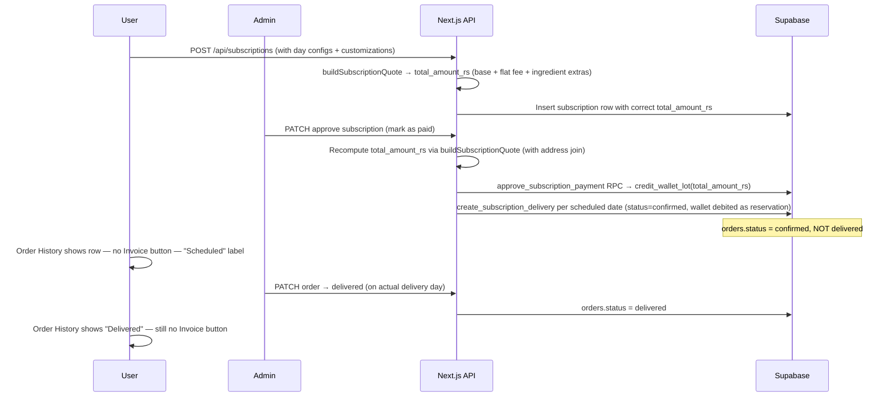

# Nutravoe — Bug Analysis & Fix Plan

> Status: **Awaiting approval before implementation**
> Date: 2026-04-04
> Source: Merged from session analysis + `subscription_pricing_and_crm_fixes` Cursor plan

---

## Root Causes at a Glance

| # | Issue | Root cause file(s) |
|---|---|---|
| 1 | Customization cost capped at ₹90 | `SubscribeWizard.tsx` lines 495–498 |
| 2 | Wallet loads wrong amount on approval | `checkout-security.ts` + admin `[id]/route.ts` |
| 3 | All future orders auto-show as delivered | `006_wallet_integrity.sql` RPC + admin approval loop |
| 4 | Invoice shown for subscription bowl orders | `orders/page.tsx` + `invoice/[orderId]/page.tsx` |
| 6 | Invoice unit price & customization not separated | `order_items` schema + all order creation flows |
| 7 | No Top Up button on wallet page | `wallet/page.tsx` |

---

## Issue 1 — Customization cost display capped at ₹90

### What is happening

In `app/subscribe/SubscribeWizard.tsx` the displayed weekly total is:

```ts
// lines 495–498
const customisedCount = countCustomisedBowls();
const customisationSurcharge = currentPlan
  ? customisedCount * (currentPlan.customisationChargePerBowl ?? 0)
  : 0;
const totalWeeklyPrice = currentPlan ? currentPlan.weeklyPrice + customisationSurcharge : 0;
```

This is **only** the base plan price plus a **flat fee per customised bowl** (`customisationChargePerBowl`, e.g. ₹30). It never adds the sum of per-ingredient `extraCost` values. With a 3-bowl plan the max it can ever show is `3 × ₹30 = ₹90`.

The server-side `buildSubscriptionQuote` in `lib/checkout-security.ts` already computes all three components correctly:

```ts
// line 207
const totalAmountRs = (perBowl * plan.bowlsPerCycle)
  + (customisedBowlCount * customisationChargePerBowl)
  + totalIngredientExtrasRs;   // ← this term is missing from the UI
```

### Fix

In `SubscribeWizard.tsx`:
1. Compute `totalIngredientExtras` by summing `calcCustomCost()` across all days/bowls (Scenario A: `dayBowlCustomMap`; Scenario C: `dayCustomMap`).
2. Add it to `totalWeeklyPrice`.
3. Show a visible price breakdown below the total:
   - Base plan: `perBowl × bowlsPerCycle`
   - Customisation handling: `customisedCount × customisationChargePerBowl`
   - Ingredient extras: `totalIngredientExtras`

### Files
- `app/subscribe/SubscribeWizard.tsx`

---

## Issue 2 — Wallet loads base subscription cost only, ignores customization

### What is happening

`approve_subscription_payment` RPC credits `v_sub.total_amount_rs` from the subscription row. That value is set at subscription creation by `buildSubscriptionQuote`. If the frontend was showing the wrong total (Issue 1) and the Sanity `ingredient.extraCost` values are zero or the ingredient ID lookup misses, then `total_amount_rs` is stored without ingredient extras — the wallet gets loaded with only the base amount.

**Secondary bug in admin approval route** (`app/api/admin/subscriptions/[id]/route.ts`, lines 86–113): There is a re-calculation block that tries to recompute `total_amount_rs` before calling the RPC. However, the `oldSub` select query does **not** join the `addresses` table:

```ts
.select(`
  *,
  users:user_id (email, full_name),
  subscription_plans:plan_id (name, price_per_bowl),
  subscription_day_configs (*)
  // ← addresses NOT joined
`)
```

So `oldSub.addresses` is `undefined` → `addrRecord = {}` → `isNearZoneAddress({})` returns `false` (fail-safe = far zone). For near-zone customers this silently recalculates at far-zone pricing and overwrites the correct `total_amount_rs` stored at subscription creation. Additionally, the block only runs when `oldSub.status === 'pending'` — so re-approvals skip re-calculation entirely.

### Fix

1. **At subscription creation** (`POST /api/subscriptions`): already calls `buildSubscriptionQuote` — confirm `totalIngredientExtrasRs` is non-zero once Issue 1 ingredient data is fixed.
2. **At admin approval**: always recompute `total_amount_rs` using `buildSubscriptionQuote` with the correct address (join `delivery_address_id → addresses` in the `oldSub` select, or fetch address separately). Run this for all subscriptions, not just `pending`.
3. Update the row **before** calling `approve_subscription_payment` RPC, so the RPC credits the correct amount.

### Files
- `app/api/admin/subscriptions/[id]/route.ts` — fix address join + widen recompute condition
- `lib/checkout-security.ts` — no change needed; logic is already correct

---

## Issue 3 — Future subscription orders auto-show as delivered on approval

### What is happening

This is the most critical bug. `create_subscription_delivery` RPC in `supabase/migrations/006_wallet_integrity.sql` hardcodes `status = 'delivered'` on every order it creates:

```sql
-- line 427
'delivered',
```

When admin approves a spread subscription, the auto-generation loop in `app/api/admin/subscriptions/[id]/route.ts` (lines 138–171) calls `create_subscription_delivery` for every day config. All 5–6 weekly orders are instantly set as `delivered` with wallet already fully debited. The user sees all future days as delivered; the admin sees them the same way. There is no way to mark them individually on their actual delivery dates.

### Fix

**Minimum-disruption approach** (recommended): keep wallet debit at order creation (current behaviour — acts as reservation), but fix the `status`.

**Step A — New migration:** Parameterise `create_subscription_delivery` to accept `p_status text default 'delivered'`. When called with `'confirmed'`, write `status = 'confirmed'` but still call `consume_wallet_balance` (wallet reserved). Existing manual "Schedule Delivery" button in admin continues to pass `'delivered'` so its behaviour is unchanged.

**Step B — Auto-generation:** Change the approval loop to call with `p_status = 'confirmed'`. The TODAY order that is past the 2-hour cutoff also starts as `confirmed` — admin marks it delivered like any other day.

**Step C — Admin mark-delivered:** Confirm that `PATCH /api/admin/orders/[id]` transitions to `delivered` correctly for subscription orders. No wallet change is needed at this step since the wallet was debited at creation.

**Step D — Backfill (one-off SQL):** Existing subscription orders with a future `delivery_date` that are currently `delivered` need to be set back to `confirmed`. Write a one-off migration or admin script.

**UI note:** After this fix, subscription orders will show `payment_status = 'paid'` (wallet debited) but `status = 'confirmed'` (not yet delivered). Make sure the orders list doesn't confuse users — add a "Scheduled" label or similar so it reads clearly.

### Files
- `supabase/migrations/` — new migration adding `p_status` param + backfill script
- `app/api/admin/subscriptions/[id]/route.ts` — pass `p_status = 'confirmed'` in approval loop
- `app/api/admin/orders/[id]/route.ts` — verify delivered transition works for subscription orders

---

## Issue 4 — Invoice download appears on subscription bowl orders

### What is happening

`app/(dashboard)/orders/page.tsx` shows an invoice link for every order where `status = 'delivered'` AND `payment_status = 'paid'`. The query only fetches basic fields — `subscription_id` and `order_type` are not fetched — so the page cannot distinguish subscription orders from standalone ones.

Subscription bowl orders are wallet transactions. No separate payment event occurred. An invoice should only exist when the user made a direct payment: standalone order or the subscription payment itself.

### Fix

1. Add `subscription_id, order_type` to the select query in `orders/page.tsx`.
2. Hide the Invoice button when `subscription_id IS NOT NULL`.
3. Optionally add a subtle "Subscription · Wallet" badge on subscription order rows with a link to the Wallet page.
4. In `app/invoice/[orderId]/page.tsx`: if the fetched order has `order_type = 'subscription'` or `subscription_id IS NOT NULL`, redirect to `/orders` — prevents anyone deep-linking to a subscription order invoice.

### Files
- `app/(dashboard)/orders/page.tsx`
- `app/invoice/[orderId]/page.tsx`

---

## Issue 6 — Invoice unit price and customization cost not split in columns

### What is happening

The invoice has dedicated **Unit Price** and **Customisation** columns. It derives the customization cost as:

```ts
// invoice/[orderId]/page.tsx line 228
const customCost = Number(item.total_price) - (Number(item.unit_price) * item.quantity);
```

However, `order_items.unit_price` is stored as the **combined** price (base + customization upcharge). In `lib/checkout-security.ts`:

```ts
const unitPrice = baseUnitPrice + customizationUpcharge;
```

And in the approval loop (`app/api/admin/subscriptions/[id]/route.ts`):

```ts
unit_price: unitPrice + (config.customization_cost_rs ?? 0),
```

So `total_price = unit_price × qty` always, `customCost` is always 0, and the Customisation column shows "—" even when extras were ordered.

### Fix

1. **Schema migration:** Add `customization_cost_rs numeric(10,2) default 0` to `order_items`.
2. **`buildAuthoritativeOrder`** (`lib/checkout-security.ts`): store base price in `unit_price`, put upcharge in `customization_cost_rs` on each line item.
3. **`create_subscription_delivery` RPC**: update JSON payload parsing to accept `customization_cost_rs` per item and write it to the new column.
4. **Wallet order API** (`app/api/orders/wallet/route.ts`): same split.
5. **Invoice page**: read `item.customization_cost_rs` directly from the DB field instead of back-computing. Add a fallback for legacy rows (pre-migration) using the old heuristic.

### Files
- `supabase/migrations/` — new migration for `order_items.customization_cost_rs`
- `lib/checkout-security.ts`
- `supabase/migrations/006_wallet_integrity.sql` — `create_subscription_delivery` RPC
- `app/api/orders/wallet/route.ts`
- `app/invoice/[orderId]/page.tsx`

> **Note:** This is the most invasive change (DB schema + multiple writers). Confirm whether to include now or defer.

---

## Issue 7 — No "Top Up Wallet" option on wallet page

### What is happening

`app/(dashboard)/wallet/page.tsx` shows balance and transactions but no CTA to request a top-up. `TopupModal.tsx` exists in the subscriptions page but only mounts for flexible subscription holders.

**Product rule (confirmed):** The Top Up button should appear **only** for users with an active `style = 'flexible'` subscription. **Do not** show it for spread-across-the-week or other plan types — those users pay per weekly cycle via subscription approval and WhatsApp, not ad-hoc top-ups from this screen.

### Fix

1. On wallet page load, query the user's active subscription (if any) and check `style`.
2. If `style === 'flexible'` and `status === 'active'`, show a **"Top Up Wallet"** button in the page header.
3. On click, open `TopupModal` (reuse the existing component) with the subscription ID and expiry.
4. For all other cases (spread, no subscription, pending, etc.) — omit the button entirely.

### Files
- `app/(dashboard)/wallet/page.tsx`
- `app/(dashboard)/subscriptions/TopupModal.tsx` — no changes needed, reuse as-is

---

## Target state: subscription delivery flow



---

## Implementation Order

| Priority | Issue | Scope | Risk |
|---|---|---|---|
| 1 | **Issue 3** — Fix auto-delivered status | New migration + 2 API routes + backfill | High — RPC change |
| 2 | **Issue 1 + 2** — Pricing display + wallet load | `SubscribeWizard.tsx` + `checkout-security.ts` + admin approval route | Medium |
| 3 | **Issue 4** — Hide invoice on subscription orders | `orders/page.tsx` + `invoice/page.tsx` | Low |
| 4 | **Issue 7** — Top Up button (flexible only) | `wallet/page.tsx` | Low |
| 5 | **Issue 6** — Invoice columns split | New DB migration + 4 files | High — schema change |

---

## Open Questions

1. **Issue 6** is the most invasive (new DB column, 4+ files). Implement now or defer to a separate sprint?
2. **Issue 3 — Backfill**: Are there existing subscription orders in production with future `delivery_date` incorrectly marked `delivered`? If yes, a one-off SQL needs to be run. Confirm before applying the migration.
3. **Issue 3 — TODAY order**: The order that was auto-generated for today (past the 2-hour cutoff) — should it start as `confirmed` and admin marks it delivered, or is it acceptable to mark it `delivered` automatically since the window has passed?
4. **Issue 1 — Sanity data**: Do the `customizableIngredients` in Sanity have non-zero `extraCost` values set? If yes, the code fix alone resolves the display. If no, the prices need to be entered in Sanity too.

---

## Risks & Notes

- Changing `create_subscription_delivery` status semantics may affect admin dashboard counts that aggregate by `status = 'delivered'`. Audit admin filters after the migration.
- After Issue 3 fix, subscription orders will have `payment_status = 'paid'` (wallet reserved) but `status = 'confirmed'` (not yet delivered). Ensure UI copy reflects this clearly so users are not confused by "Paid but not Delivered".
- The admin approval re-calculation (Issue 2) overwrites `total_amount_rs`. If a user calls support and the admin re-approves, this could credit a different amount from what the customer paid. Add a log or admin-visible note showing original vs recomputed totals.
